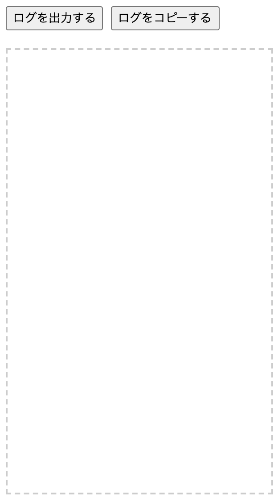
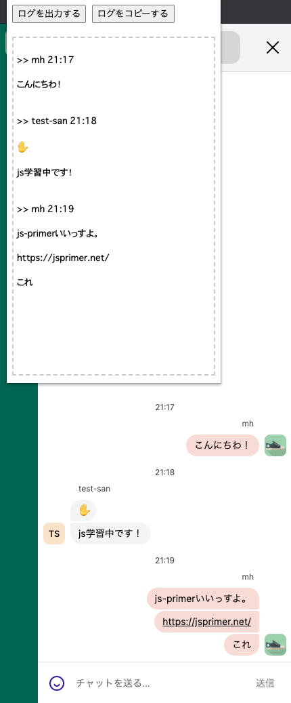
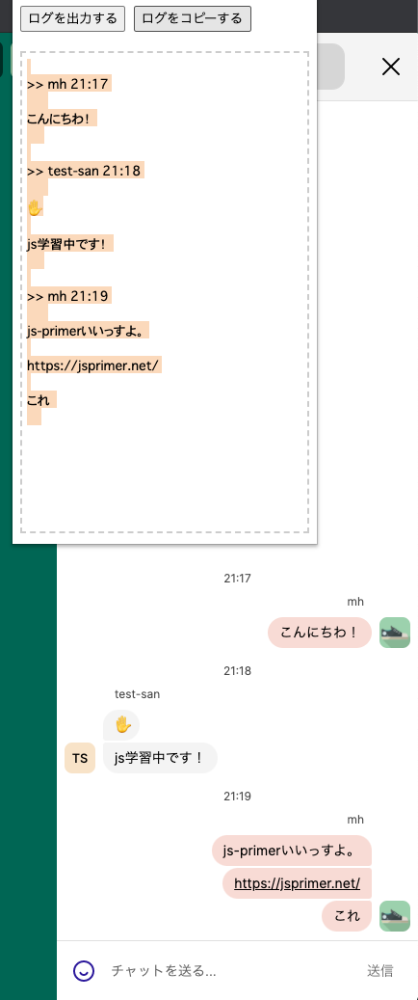

## Whereby Log Exporter

WherebyのチャットログをエクスポートするChrome拡張です。

## Chrome拡張のインストール

1. 本リポジトリをクローンします。もしくは、ZIPファイルでコードをダウンロードします。
```
$ git clone git@github.com:mh-mobile/whereby-log-exporter.git
```
2. Chromeのアドレスバーにchrome://extensionsを入力します。
3. 拡張機能画面のデベロッパーモードをONにします。
4. 同画面の`パッケージ化されていない拡張機能を読み込む`をクリックします。
5. 1で取得したコードのmanifest.jsonファイルが含まれるディレクトリを選択します。
6. Chromeのアドレスバーの横のツールバーに本拡張のアイコンが表示されない場合は、ツールバー上の拡張機能アイコンを
選択します。次に、拡張機能のポップアップで、Whereby Log Exporterのピンを選択し、拡張機能を固定します。
7. Whereby Log Exporterのアイコンがツールバー上に表示されることを確認します。

## Chrome拡張の使い方

### Chrome拡張のポップアップ画面の表示
1. https://whereby.com にて、任意のルームに入ります。
2. チャット画面を開いた状態で、Whereby Log ExporterのChrome拡張のアイコンを選択します。
3. Chrome拡張のポップアップ画面が表示されます。




### チャットのログの出力

チャットのログが書き込まれた状態で、ログを出力するボタンを選択します。
選択後、ポップアップ画面の枠線内のエリアにチャットのログを出力します。



### チャットのログのコピー

チャットのログがポップアップ画面に出力された状態で、ログをコピーするボタンを選択します。
選択後、クリップボードにログのテキストデータがコピーされます。

※テキストデータが選択状態になりますが、この時点でクリップボードにコピーされています。




## その他

Chrome DevToolsのコンソールログにチャットログを出力したい場合は、以下のGistを参照してください。

[https://gist.github.com/mh-mobile/721b33501b5cc84708095025c6dd5097](https://gist.github.com/mh-mobile/721b33501b5cc84708095025c6dd5097)

